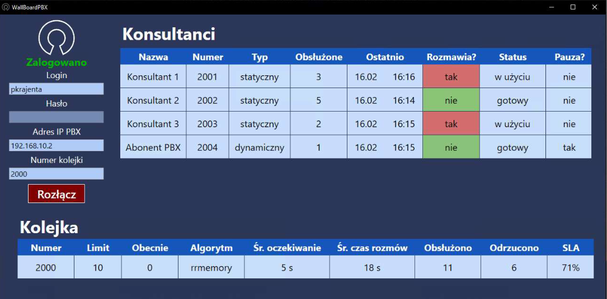

# WallBoardPBX
## Overview

Designed for monitoring queues and queue agents in Asterisk IP PBX systems. It leverages the Asterisk Manager Interface (AMI) to interact with the Asterisk system, providing real-time data and notifications.  
  

## Features

   Queue Monitoring: Track and manage queues within the Asterisk system.  
    Agent Monitoring: Monitor the status and performance of queue agents.  
    AMI Integration: Uses Asterisk Manager Interface for data retrieval and notifications.  

## Prerequisites

   Asterisk PBX: Ensure that your Asterisk PBX system is set up and running.  
    AMI Configuration: Configure AMI access by modifying the /etc/asterisk/manager.conf file to include user credentials.  

## Setup

  Configure AMI Access:  
        Modify the /etc/asterisk/manager.conf file to set up a user account with appropriate credentials for AMI access.  

  You can use the built version contained in this repository.    
  Alternatively -  Build and Run:
        Clone the repository and open the solution in Visual Studio.  
        Build the project using .NET 6.0.  
        Run the application to start monitoring. 

## Usage

  Launch the application.  
    Connect to your Asterisk PBX using the configured AMI credentials.  
    Use the interface to view and manage queues and agents.  
